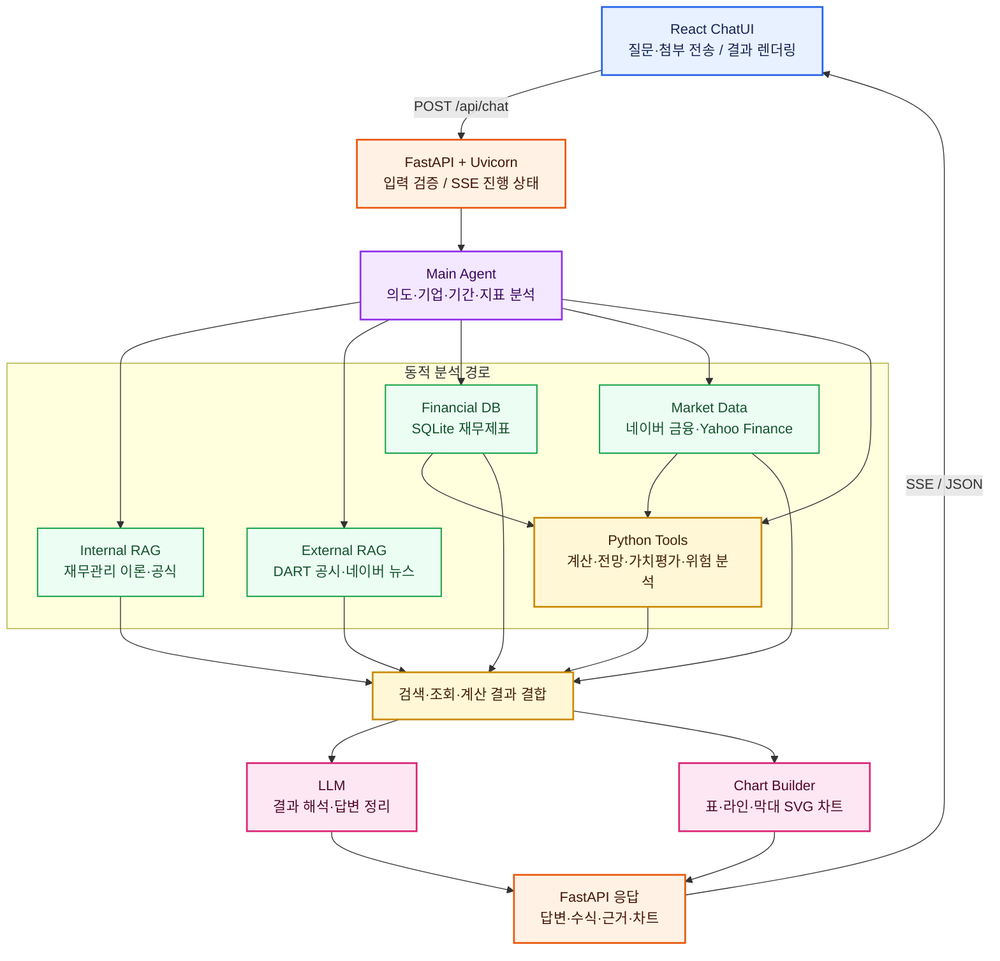

# 🤖 Corporate Finance Bot

재무 데이터와 AI를 결합한 대화형 기업재무 분석 챗봇

Author: 장영우 · Email: yeongwuu@naver.com

## Project Overview

| 항목 | 내용 |
|---|---|
| 프로젝트 목표 | 보유 데이터를 기반으로 재무관리 질문에 답변하는 챗봇 구축 |
| 개발 기간 | 2026. 07. 09 ~ 진행 중 |
| 기술 스택 | Python(FastAPI), React(Vite), DART Open API, 네이버 뉴스·금융 API, LLM API(Gemini/OpenAI), SQLite |
| 핵심 구조 | Frontend(React) ↔ Backend(FastAPI) ↔ Main Agent(라우터) ↔ Internal·External RAG + LLM + Python Tools |
| 배포 방식 | Render Blueprint(API 서비스 + 정적 웹 서비스 분리 배포) |
| 배포 URL | https://corporate-finance-bot-web.onrender.com |

## 핵심 기능

- **재무지표 분석**: 기업 재무 데이터를 바탕으로 성장성·수익성·안정성 지표를 분석하고 기간별 변화와 기업 간 차이를 시각화
- **주가·위험 분석**: 과거 주가 데이터를 바탕으로 수익과 위험을 측정하고 시계열 예측·기업 비교·포트폴리오 분석을 지원
- **가치평가 및 시나리오 분석**: 기업가치·자본비용·현금흐름을 바탕으로 가치평가를 수행하고 다양한 가정에 따른 민감도와 위험 시나리오를 분석
- **이론 및 문제 학습**: 재무관리 이론을 예제와 함께 학습하고 이미지·PDF 문제의 풀이 과정과 계산 결과를 제공

## 처리 구조

Corporate Finance Bot은 하나의 질문을 고정된 방식으로 처리하지 않습니다. 질문의 목적과 필요한 데이터에 따라 여러 분석 경로를 동적으로 조합합니다.



## 핵심 설계

- **멀티 동적 라우팅**: 질문의 의도·기업·기간·지표를 분석해 필요한 데이터와 Python Tool을 단독 또는 복합 선택
- **Internal·External RAG 분리**: 고정된 재무 이론과 계속 변하는 공시·뉴스를 서로 다른 검색 경로로 관리
- **계산과 해석의 역할 분리**: Python Tool이 공식과 수치를 계산하고 LLM은 결과 해석과 답변 정리를 담당

## 데이터

2019~2025년 코스피 시장의 Excel 재무 데이터를 사용하며 재무상태표, 손익계산서와 현금흐름표를 포함합니다. Excel 데이터를 정규화해 SQLite 데이터베이스에 적재하고 기업·연도·계정별 재무정보를 조회합니다.

## UI/UX

- 재무 분석 서비스의 신뢰감과 가독성을 고려한 전체 색상·배경·버튼 체계 통일
- 데스크톱과 모바일 화면에서 채팅·추천 패널·차트가 자연스럽게 배치되는 반응형 구성
- SSE를 활용해 질문 해석, 데이터 확인, 계산과 답변 생성 상태를 실시간으로 표시
- 검증된 추천 질문 5개를 상시 제공하고 재생성 시 직전 질문이 반복되지 않도록 구성
- 내부 Tool 이름 대신 사용자가 이해하기 쉬운 아이콘과 데이터 확인·계산·답변 정리 문구 사용
- 데이터 성격에 따라 라인·막대 SVG 차트를 구분하고 음수 값, 긴 라벨과 복수 지표의 가독성을 조정
- 답변 복사·공유와 실패 질문 수집 동의를 한 흐름에서 처리

## 실패 질문 수집과 개인정보 동의

데이터 부족이나 분석 실패가 발생해도 질문을 자동으로 수집하지 않으며, 사용자가 동의한 경우에만 저장합니다. 동의받은 실패 질문은 `backend/data/failed_questions.json`에 기록합니다.

## 프로젝트 구조

```text
frontend/
├── src/ChatUI.jsx          # 채팅, 추천 질문, 동의 UI, 차트 렌더링
├── src/styles.css          # 반응형 UI 스타일
└── src/main.jsx            # React 진입점

backend/
├── server.py               # FastAPI, SSE, 추천 질문, 동의 기반 실패 로그
├── main_agent.py           # 질문 분류, 맥락 연결, Tool 조율
├── llm_client.py           # LLM 및 규칙 기반 답변 생성
├── chart_builder.py        # 차트 데이터 스펙 생성
├── dart_client.py          # DART 공시·재무계정 조회
├── news_client.py          # Naver News 수집
├── company_data/
│   └── financial_store.py  # SQLite 재무 데이터 조회
├── data/
│   ├── account_mapping.json
│   ├── financials.sqlite.gz
│   └── successful_questions.json
├── rag/
│   ├── internal_rag.py
│   └── external_rag.py
├── knowledge/              # 재무관리 기준 문서 9개
└── tools/                  # 재무 분석·계산 Tool
```

## 배포

`render.yaml`은 API와 정적 웹 서비스를 함께 배포합니다.

1. 저장소를 GitHub에 push합니다.
2. Render에서 Blueprint로 저장소를 연결합니다.
3. API 서비스에 LLM, DART, Naver 환경변수를 설정합니다.
4. `corporate-finance-bot-api`와 `corporate-finance-bot-web`을 배포합니다.

Render 무료 인스턴스는 비활성화 후 첫 요청이 느릴 수 있습니다.
